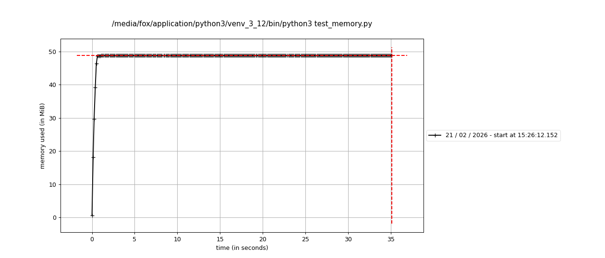
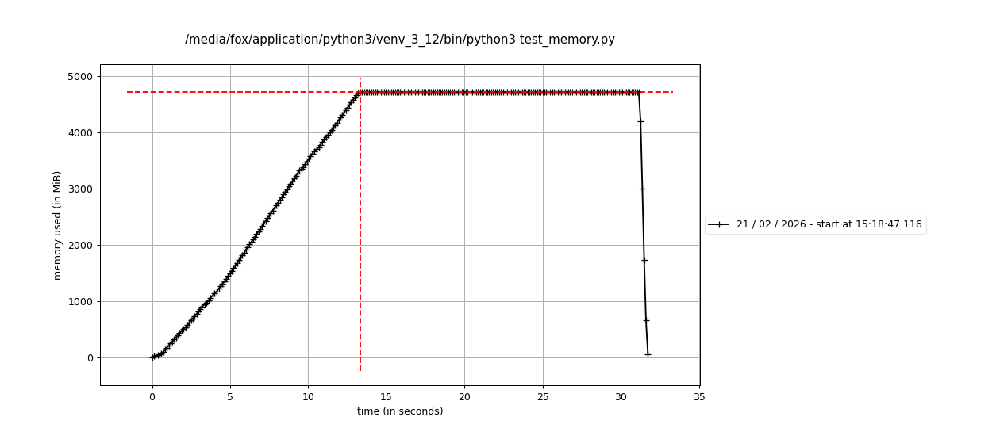
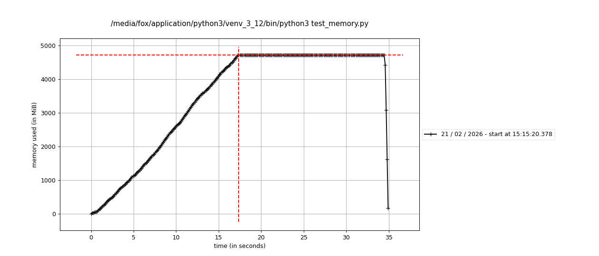
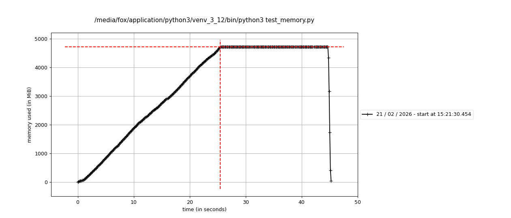

# Memory — тестирование памяти структур данных в Python

Тестирование выделения памяти и утилизация под разные структуры данных на Python 3 и специальный объект — **генератор**, который вычисляет значения данных на лету.

## Описание

Скрипт `test_memory.py` с помощью [memory_profiler](https://pypi.org/project/memory-profiler/) профилирует потребление памяти для четырех типов структур и один объект:

| Структура/Объект   | Описание |
|------------|----------|
| **dict**   | Словарь `{i: f"{i}" * MULTIPLY for i in range(RANGE)}` |
| **set**    | Множество `{f"{i}" * MULTIPLY for i in range(RANGE)}` |
| **list**   | Список `[f"{i}" * MULTIPLY for i in range(RANGE)]` |
| **tuple**  | Кортеж `tuple(f"{i}" * MULTIPLY for i in range(RANGE))` |
| **generator** | Генератор `(f"{i}" * MULTIPLY for i in range(RANGE))` |

Параметры в коде:
- `RANGE` — количество элементов (по умолчанию 100 000)
- `MULTIPLY` — длина строки на элемент (по умолчанию 10 000)

## Требования

```bash
pip install memory-profiler
```

- Python 3.x

## Запуск

```bash
python test_memory.py
```

После выполнения отчёты по памяти появятся в каталоге `logs/`, графики (если строились) — в `mprofile/`.

## Структура проекта

```
Memory/
├── READMY.MD           # этот файл
├── test_memory.py      # скрипт профилирования
├── logs/               # логи memory_profiler по каждой структуре
│   ├── test_memory_dict.log
│   ├── test_memory_set.log
│   ├── test_memory_list.log
│   ├── test_memory_tuple.log
│   └── test_memory_gen.log
└── mprofile/           # данные и графики mprofile (при использовании mprof)
    ├── mprofile_*.dat
    └── mprofile_*.png
```

## Графики потребления памяти





